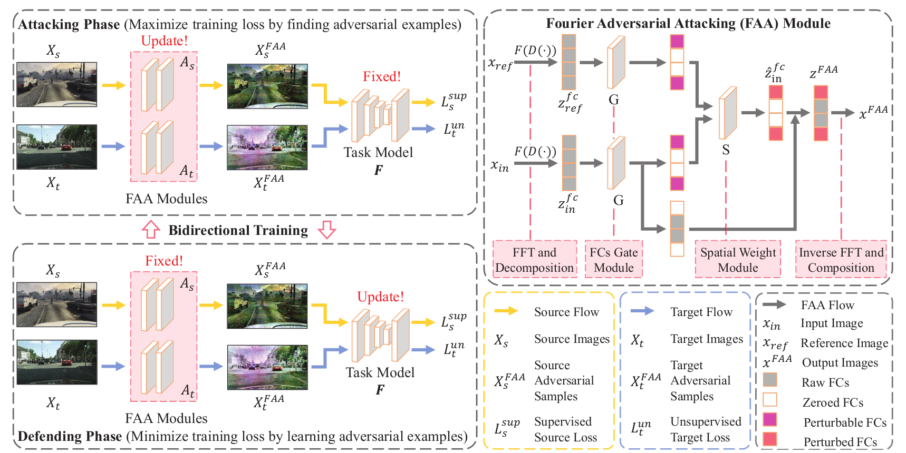

# Scale variance minimization for unsupervised domain adaptation in image segmentation

## Updates

- *06/2021*: check out our domain adaptation for panoptic segmentation paper [Cross-View Regularization for Domain Adaptive Panoptic Segmentation](https://arxiv.org/abs/2103.02584) (accepted to CVPR 2021). We design a domain adaptive panoptic segmentation network that exploits inter-style consistency and inter-task regularization for optimal domain adaptation in panoptic segmentation.[Code avaliable](https://github.com/jxhuang0508/FSDR).
- *06/2021*: check out our domain generalization paper [FSDR: Frequency Space Domain Randomization for Domain Generalization](https://arxiv.org/abs/2103.02370) (accepted to CVPR 2021). Inspired by the idea of JPEG that converts spatial images into multiple frequency components (FCs), we propose Frequency Space Domain Randomization (FSDR) that randomizes images in frequency space by keeping domain-invariant FCs (DIFs) and randomizing domain-variant FCs (DVFs) only. [Code avaliable](https://github.com/jxhuang0508/CVRN).
- *06/2021*: check out our domain adapation for object detection paper [Uncertainty-Aware Unsupervised Domain Adaptation in Object Detection](https://arxiv.org/abs/2103.00236) (accepted to IEEE TMM 2021). We design a uncertainty-aware domain adaptation network (UaDAN) that introduces conditional adversarial learning to align well-aligned and poorly-aligned samples separately in different manners. [Code avaliable](https://github.com/Dayan-Guan/UaDAN).

## Paper

[Scale variance minimization for unsupervised domain adaptation in image segmentation](https://www.researchgate.net/publication/347421562_Scale_variance_minimization_for_unsupervised_domain_adaptation_in_image_segmentation)  
 [Dayan Guan](https://scholar.google.com/citations?user=9jp9QAsAAAAJ&hl=en), [Jiaxing Huang](https://scholar.google.com/citations?user=czirNcwAAAAJ&hl=en&oi=ao),  [Xiao Aoran](https://scholar.google.com/citations?user=yGKsEpAAAAAJ&hl=en), [Shijian Lu](https://scholar.google.com/citations?user=uYmK-A0AAAAJ&hl=en)  
 School of Computer Science Engineering, Nanyang Technological University, Singapore  
 Pattern Recognition, 2021.
 
If you find this code useful for your research, please cite our [paper](https://www.researchgate.net/publication/347421562_Scale_variance_minimization_for_unsupervised_domain_adaptation_in_image_segmentation):

```
@article{guan2021scale,
  title={Scale variance minimization for unsupervised domain adaptation in image segmentation},
  author={Guan, Dayan and Huang, Jiaxing and Lu, Shijian and Xiao, Aoran},
  journal={Pattern Recognition},
  volume={112},
  pages={107764},
  year={2021},
  publisher={Elsevier}
}
```

## Abstract

We focus on unsupervised domain adaptation (UDA) in image segmentation. Existing works address this challenge largely by aligning inter-domain representations, which may lead over-alignment that impairs the semantic structures of images and further target-domain segmentation performance. We design a scale variance minimization (SVMin) method by enforcing the intra-image semantic structure consistency in the target domain. Specifically, SVMin leverages an intrinsic property that simple scale transformation has little effect on the semantic structures of images. It thus introduces certain supervision in the target domain by imposing a scale-invariance constraint while learning to segment an image and its scale-transformation concurrently. Additionally, SVMin is complementary to most existing UDA techniques and can be easily incorporated with consistent performance boost but little extra parameters. Extensive experiments show that our method achieves superior domain adaptive segmentation performance as compared with the state-of-the-art. Preliminary studies show that SVMin can be easily adapted for UDA-based image classification.

## Installation
1. Conda enviroment:
```bash
conda create -n svmin python=3.6
conda activate svmin
conda install -c menpo opencv
pip install torch==1.0.0 torchvision==0.2.1
```

2. Clone the [ADVENT](https://github.com/valeoai/ADVENT):
```bash
git clone https://github.com/valeoai/ADVENT.git
pip install -e ./ADVENT
```

3. Clone the [CRST](https://github.com/yzou2/CRST):
```bash
git clone https://github.com/yzou2/CRST.git
pip install packaging h5py
```

4. Clone the repo:
```bash
git clone https://github.com/Dayan-Guan/SVMin.git
pip install -e ./SVMin
cp SVMin/crst/*py CRST
cp SVMin/crst/deeplab/*py CRST/deeplab
```

### Prepare Dataset
* **GTA5**: Please follow the instructions [here](https://download.visinf.tu-darmstadt.de/data/from_games/) to download images and semantic segmentation annotations. The GTA5 dataset directory should have this basic structure:
```bash
SVMin/data/GTA5/                               % GTA dataset root
SVMin/data/GTA5/images/                        % GTA images
SVMin/data/GTA5/labels/                        % Semantic segmentation labels
...
```

* **Cityscapes**: Please follow the instructions in [Cityscape](https://www.cityscapes-dataset.com/) to download the images and validation ground-truths. The Cityscapes dataset directory should have this basic structure:
```bash
SVMin/data/Cityscapes/                         % Cityscapes dataset root
SVMin/data/Cityscapes/leftImg8bit              % Cityscapes images
SVMin/data/Cityscapes/leftImg8bit/val
SVMin/data/Cityscapes/gtFine                   % Semantic segmentation labels
SVMin/data/Cityscapes/gtFine/val
...
```

### Pre-trained models
Pre-trained models can be downloaded [here](https://github.com/Dayan-Guan/SVMin/releases/tag/Latest) and put in ```SVMin/pretrained_models```

### Evaluation
To evaluate SVMin:
```bash
python test.py --cfg configs/SVMin_pretrained.yml
```

To evaluate SVMin_AL:
```bash
python test.py --cfg configs/SVMin_AL_pretrained.yml
```

To evaluate SVMin_AL_TR:
```bash
python evaluate_advent.py --test-flipping --data-dir ../SVMin/data/Cityscapes --restore-from ../SVMin/pretrained_models/SVMin_AL_TR_pretrained.pth --save ../SVMin/experiments/GTA2Cityscapes_SVMin_AL_TR
```

### Training
To train SVMin:
```bash
python train.py --cfg configs/SVMin.yml
```

To test SVMin:
```bash
python test.py --cfg configs/SVMin.yml
```

To train SVMin_AL and SVMin_AL_TR:

Coming soon.

## Acknowledgements
This codebase is heavily borrowed from [ADVENT](https://github.com/valeoai/ADVENT) and [CRST](https://github.com/yzou2/CRST).

## Contact
If you have any questions, please contact: dayan.guan@ntu.edu.sg
